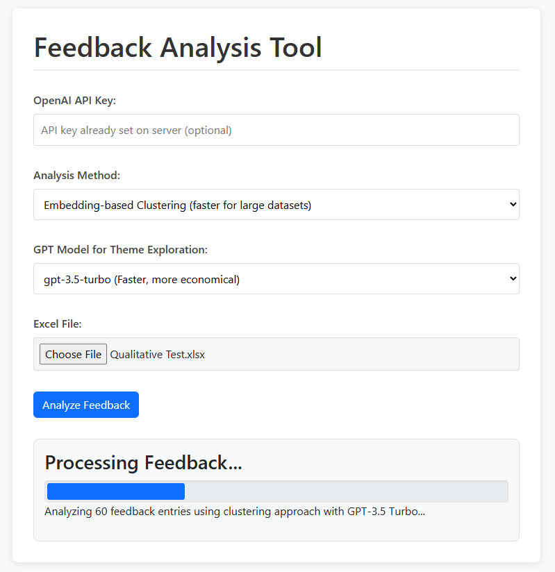
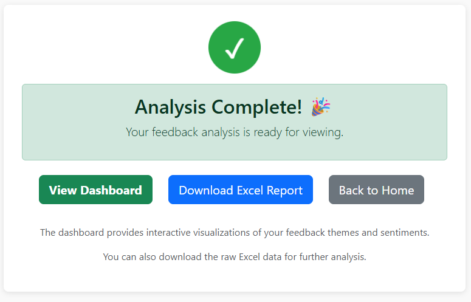
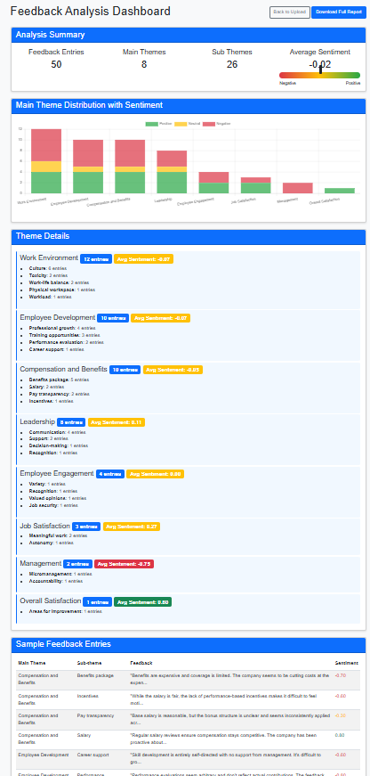
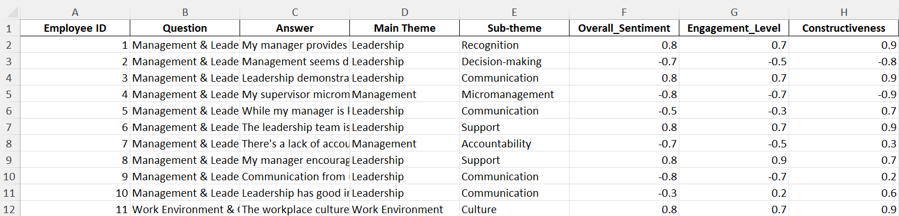
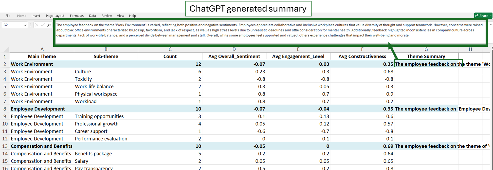
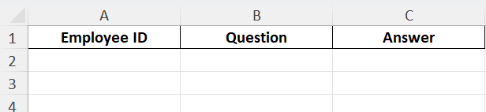

# Qualitative Analysis Tool

A web application for analyzing qualitative data (e.g. employee feedback) using ChatGPT for theme detection and sentiment analysis. This tool helps organizations extract meaningful insights from qualitative feedback data.

**Benefits:**
Unlike the ChatGPT web interface, this app can directly process Excel files and automatically assign main themes and sub-themes to each response, outputting structured results—no manual copy-paste or formatting required. As the app has the ability to read all responses before generating themes, the themes are more consistent and context-aware across your datasets.


## Features

- **AI Analysis**: Leverages OpenAI models to identify themes and analyze sentiment
- **Interactive Dashboard**: Visualize feedback themes and sentiment distribution
- **Report Generation**: Download detailed Excel reports of the analyzed feedback
- **Customizable Analysis**: Choose between direct GPT analysis or clustering approach
- **Max Cluster Selection**: When using the **Clustering Method**, you can control the granularity of your analysis by setting the "Maximum number of themes (clusters)
- **Model Selection**: Select from different GPT models based on your needs
- **Flexible Uploads**: Accepts both Excel (.xlsx, .xls) and CSV (.csv) files for feedback data

## Screenshots

Below are some screenshots to give you a quick look at the app in action:

### Home Page (Upload & Processing)


### Analysis Completion (Results Page)


### Dashboard View


### Excel Output - Data Sheet (Sheet 1)


### Excel Output - Aggregated Sheet (Sheet 2)



## Getting Started


### Input File Format

You can upload either an Excel file (`.xlsx`, `.xls`) or a CSV file (`.csv`). Your file must have the following columns (in any order):

- **Employee ID**
- **Question**
- **Answer**

Each row should represent a single feedback entry. The app will ignore rows missing an answer.

Below is a sample of the required format (as shown in Excel, but the same columns apply for CSV):



### Prerequisites

- Python 3.9+ installed
- OpenAI API key (get one at https://platform.openai.com/)
- Required Python packages (see requirements.txt)

### Installation

1. Clone this repository
2. Install the required packages:

```bash
pip install -r requirements.txt
```

3. Set your OpenAI API key as an environment variable (recommended):

```bash
# On Windows
set OPENAI_API_KEY=your_api_key_here

# On macOS/Linux
export OPENAI_API_KEY=your_api_key_here
```

Alternatively, you can enter your API key directly in the web interface.

### Running the Application

Run the included start script:

```bash
# On Windows
start_app.bat

# On macOS/Linux
python app.py
```

The application will be available at http://localhost:5000


## Usage

1. Run the application
2. Enter your OpenAI API key (if not set as environment variable)
3. Select your preferred analysis method and GPT model
4. Upload your Excel file containing feedback data
5. Wait for the analysis to complete
6. View the dashboard or download the report

## Analysis Methods for Themes and Sub-Themes


### Method 1: Clustering Method (for large datasets)

This method is optimized for large datasets and minimizes token usage by leveraging embeddings and clustering. The steps are:

1. **Embedding Generation:** Each feedback response is converted into a numerical vector (embedding) using the OpenAI embedding API.
2. **Dimensionality Reduction (PCA):** Principal Component Analysis (PCA) is applied to the embeddings to reduce dimensionality while preserving most of the variance.
3. **Clustering:** KMeans clustering is performed on the reduced embeddings to group similar feedback into main themes (clusters).
4. **Sentiment Analysis (Per Theme):** For each main theme, up to 10 sample responses are selected and analyzed by GPT to determine average sentiment, engagement, and constructiveness scores. All responses in the same main theme share these scores.
5. **Main Theme Naming:** GPT is used to generate a concise name for each main theme based on representative samples.
6. **Sub-theme Clustering:** Within each main theme, further clustering is performed to identify sub-themes, which are also named using GPT.
7. **Theme Summary:** For each main theme, GPT summarizes up to 10 sample responses to provide a concise theme summary.


### Method 2: Direct GPT Method (better for small datasets)

This method is best for small datasets and provides detailed, individualized analysis. The steps are:

1. **Theme Exploration:** All feedback responses are sent to GPT in a single prompt to identify main themes and sub-themes.
2. **Sentiment & Theme Assignment:** Each feedback response is individually analyzed by GPT to assign sentiment, engagement, constructiveness scores, and the most appropriate main and sub-theme.
3. **Theme Summary:** For each main theme, GPT summarizes up to 10 sample responses to provide a concise theme summary.

## Token Cost Estimates (for 1000 feedback responses)

- The **Clustering Method** is much more cost-efficient for large datasets, as it minimizes the number of expensive GPT API calls by using embeddings and clustering. Typical usage for 1000 responses is around 170,000 tokens.
- The **Direct GPT Method** is more expensive for large datasets, as it requires more frequent and larger GPT API calls. For 1000 responses, token usage can be around 680,000 tokens.
- For more information, refer to Learning.md

Choose the Clustering Method for large datasets to save on cost and processing time. Use the Direct GPT Method for small datasets when you want more individualized analysis.

## File Structure

- `app.py`: Main Flask application
- `feedback_analysis.py`: Core analysis logic
- `templates/`: HTML templates for the web interface
  - `index.html`: Main upload page
  - `result.html`: Analysis completion page
  - `dashboard.html`: Interactive visualization dashboard
- `uploads/`: Directory for uploaded feedback files
- `analysis_output/`: Directory for generated reports

## Contributing

Contributions are welcome! Please feel free to submit a Pull Request.
